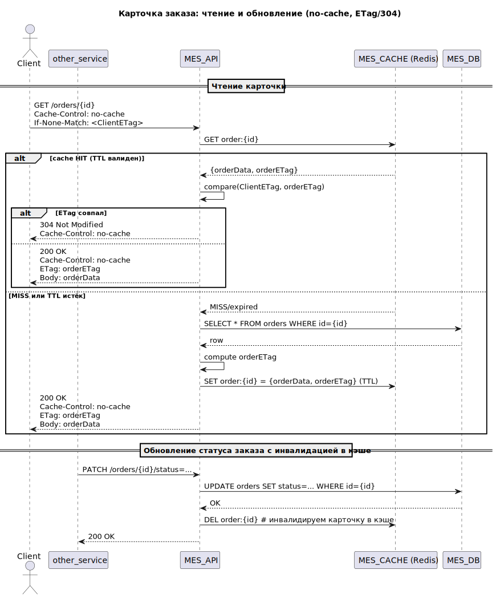

## Архитектурное решение по кэшированию

### 1. Мотивация
    Опишите здесь, почему вы предлагаете внедрить кеширование, какие проблемы оно должно решить и какие элементы системы 
    вы планируете включить в кеширование
Исходя из описания текущей системы, имеется проблема с долгой прогрузкой заказов в MES, где не помогает фильтр по статусам и пагинация.
- Вероятно, внедрение кэширования для разгрузки MES_DB может помочь в этой ситуации. 
- Одновременно, нужно будет разобраться с медлительными запросами в Postgres: возможно, запросы не оптимальны (лишние джойны и т.п.) или отсутствуют нужные индексы.

### 2. Предлагаемое решение
    - Определите, какое кеширование вы будете внедрять — клиентское или серверное. Объясните, почему, на ваш взгляд, нужно использовать именно его. 
    Если вы решите куда-то внедрить серверное кеширование, то поясните, какой паттерн будете применять — Cache-Aside, Write-Through или Refresh-Ahead. 
    А также объясните, почему вы выбрали этот паттерн и почему остальные паттерны не подойдут или покажут себя хуже.

    - Опишите стратегию инвалидации кеша, которую вы планируете использовать. 
    Объясните, какую стратегию инвалидации вы предлагаете (временную, по ключу, программную или другие), 
    почему она подойдёт и почему не подойдут другие стратегии.
    Не всегда очевидно, какое решение лучше. Чтобы выбрать оптимальный вариант, можете сделать сравнительный анализ в виде таблицы

### Выбор настроек кэширования
**Вводные**
1. Много изменений с заказами, большая нагрузка на запись в MES_DB;
2. Нагрузка на чтение вероятно, меньше (не так много операторов), но есть пик нагрузки, когда в начале рабочего дня операторы хотят посмотреть статусы по новым заказам, которые можно брать в производство.
3. Вероятно, кэширование поможет в MES улучшить 2 пользовательских сценария доступа к данным:
   - выдача N самых последних заказов (в виде K первых страниц);
   - доступ к карточкам заказов;

**Решения**
1. В этих сценариях подойдет сочетание:
   - клиентского кэширования c `cacheControl=noCache` для гарантии получения свежих данных из связки серверного кэша и БД;
   - серверного кэширования на базе Redis;
2. Будем кэшировать:
   - списки свежих заказов; при этом допустимы окна устаревания до нескольких минут; структура ZSET с сортированным списком заказов, формируем страницы при выдаче на лету;
   - карточки заказов: недопустимо видеть заказ в неактуальном состоянии; 
3. Для кэша со списком последних заказов:
   - чтение из кэша, если `cache-miss`, то чтение из БД с обновлением данных в кэше;
   - паттерн `refresh-ahead`:
     - временная инвалидация (TTL), инвалидация по изменению состояния (статус заказа) асинхронным воркером;
     - тот же воркер обновляет изменившиеся заказы в списке последних заказов в Redis, читая актуальные данные в БД;
     - плюсы: не замедляется запись в БД, список свежих заказов обновляется быстрее, чем по TTL;
     - минусы: окна устаревших данных в Redis;
4. Для кэша с карточками заказов:
   - паттерн `сache-aside` - чтение из кэша, если `cache-miss`, то чтение из БД с обновлением данных в кэше;
   - при записи в БД одновременная событийная инвалидация данных в кэше;
   - временная инвалидация (TTL) как страховка;
   - плюсы: всегда читаем актуальные данные, за неизменившимися заказами не идем в БД, проще и надежней чем запись в БД + обновление в кэше;
   - минусов: запись в целом медленнее из-зат необходимости время одновременной инвалидации после записи в БД;
5. Использование реплицированного кластера Redis. Прогрев серверного кэша понадобится только при катастрофических авариях кластера.

### Sequence diagram (диаграмма действий)
    - Нарисуйте диаграмму последовательности действий (Sequence diagram). 
    Отобразите там, как проходит операция чтения списка заказов и запись об изменении статуса заказа. 
    Там же опишите процесс кеширования с указанием всех сущностей, которые участвуют в кешировании

**Примечания:**
- ETag — это хэш запрашиваемого содержимого (список свежих заказов, либо карточка заказа).
- TTL — один общий TTL;
- в кэше списки заказов показаны упрощенно, как страницы, но хранятся в виде ZSET, а страницы для клиента формируются на лету;
**Запросы свежих заказов с кэшированием**

- **Запросы карточек заказа с кэшированием**

